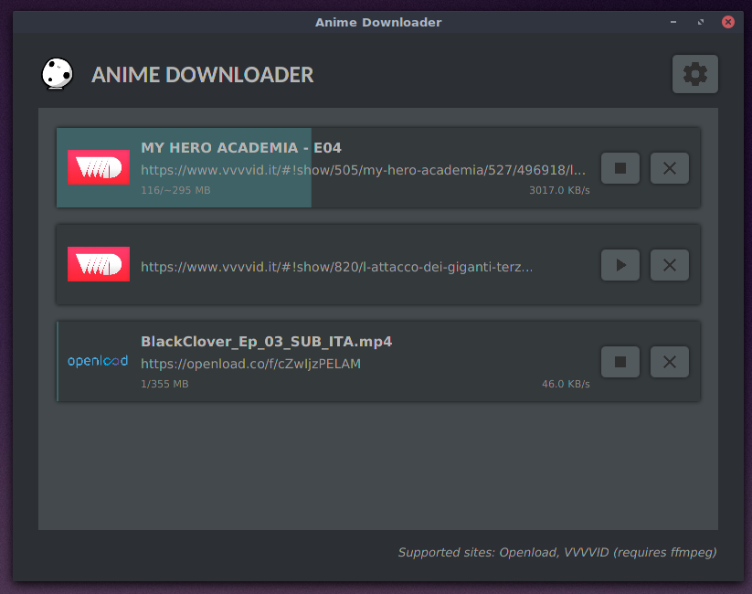
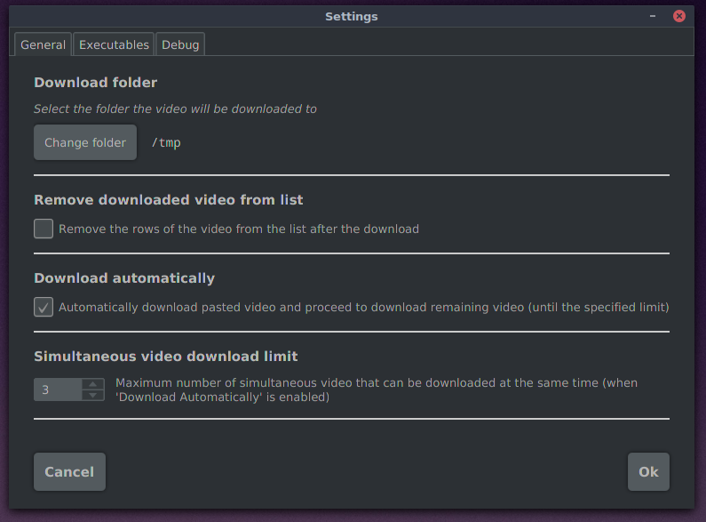

# Anime Downloader

A graphical application written in Java for download anime from common
anime sites.

### Why

I've create this application for be able to download video from different sites 
without care about annoying popups, advertisement or similar stuff. 

Moreover this downloader remembers the added video still to download even 
after its closure; this allows to add a "wish list" of video to downloader 
in the future.

Last but not least, just because I had nothing better to do =) 

### Supported OS

This works for sure on Linux and probably even on Windows and MacOS, but I
do not even want to try those OS, do it on your own ;D

### Supported sites

* VVVVID (https://www.vvvvid.it)
* Openload (https://openload.co)

### What it looks like

